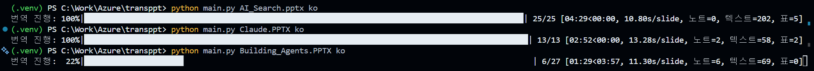

# 🎯 pptx-translator

> Azure OpenAI GPT로 PowerPoint(.pptx)를 **서식 그대로** 다국어 번역하는 Python CLI 도구

[](LICENSE)
[](https://www.python.org/)

---

## ✨ 주요 기능

| | |
|---|---|
| ⚡ **슬라이드 일괄 번역** | 텍스트박스 + 테이블 셀 + 슬라이드 노트를 슬라이드당 1회 API 호출로 번역 |
| 📝 **서식 100% 보존** | XML 레벨 `<a:t>` 텍스트만 교체 — 색상·그라데이션·폰트·크기 원본 유지 |
| 🔀 **스타일 어순 재배치** | SVO→SOV 등 어순 변경 시 `<a:rPr>` 스타일을 자동 재배치하여 강조 서식 정확 유지 |
| 🧠 **맥락 인식 번역** | 상위 5장 분석으로 전체 주제·톤 파악 → 일관된 번역 유지 |
| 🔗 **용어 일관성** | 최근 3장 번역 이력(슬라이딩 윈도우) 참조로 동일 용어 통일 |
| 🔤 **다국어 폰트 자동** | CJK·아랍어·태국어·키릴 등 7개 언어 스크립트별 최적 폰트 자동 설정 |
| 📎 **슬라이드 노트** | 발표자 노트도 본문과 함께 일괄 번역 |
| 🌍 **14개 언어** | ko, ja, zh, en, es, fr, de, pt, it, vi, th, id, ru, ar |

---

## 🚀 시작하기

### 1. 설치

```bash
pip install -r requirements.txt
```

### 2. 환경 설정

```bash
cp .env.example .env
```

`.env`에 Azure OpenAI 자격 증명을 입력:

```dotenv
AZURE_OPENAI_ENDPOINT=<<https://your-resource.openai.azure.com/>>
AZURE_OPENAI_API_KEY=<<your-api-key>>
AZURE_OPENAI_DEPLOYMENT_NAME=gpt-52
AZURE_OPENAI_API_VERSION=2025-04-01-preview
```

> `<< >>` 부분을 실제 값으로 교체하세요.

### 3. 실행

```bash
python main.py work.pptx ko                    # 전체 → 한국어
python main.py work.pptx ja -o output.pptx      # 일본어, 출력 지정
python main.py work.pptx ko -s 3-10             # 3~10번 슬라이드만
python main.py work.pptx ko -v                  # 상세 로그
```

동작 예시:  
  

번역 결과물:  


<details>
<summary>📋 전체 CLI 옵션</summary>

```
python main.py [-h] [-o OUTPUT] [-s SLIDES] [-v] input_file target_lang

input_file       번역할 PPTX 파일
target_lang      대상 언어 코드 (ko, ja, zh, en, ...)
-o, --output     출력 파일 경로 (기본: 원본명_언어코드.pptx)
-s, --slides     슬라이드 범위 (예: 5, 3-10)
-v, --verbose    상세 로그 출력
```

</details>

---

## 🔄 번역 파이프라인

### API 호출 구조

| 단계 | 호출 | 설명 |
|------|------|------|
| Phase 0 | **1회** | 상위 5장 → 프레젠테이션 맥락 요약 |
| Batch | **N회** | 슬라이드당 1회 (텍스트+테이블+노트 통합) |
| **합계** | **1 + N** | N = 번역 대상 슬라이드 수 |

---

## 📁 구조 & 파이프라인 매핑

```
pptx-translator/
  ├── main.py ··········· CLI + 파이프라인 오케스트레이션
  │                        ├─ PPTX 로드 / 복제
  │                        ├─ Phase 0 호출 (translator.py)
  │                        ├─ 슬라이드 루프: Batch 번역 → Apply
  │                        └─ 결과 저장
  │
  ├── translator.py ····· Azure OpenAI 번역 엔진
  │                        ├─ get_presentation_summary()  ← Phase 0
  │                        ├─ translate_slide_batch()      ← Batch (1 call/slide)
  │                        └─ translate_styled_text()      ← 개별 폴백
  │
  ├── pptx_handler.py ··· PPTX 파싱 / XML 스타일 엔진
  │                        ├─ extract_styled_paragraphs()  ← Run 구조 + rPr 추출
  │                        ├─ apply_translated_runs()      ← <a:t> 교체 + 스타일 재배치
  │                        ├─ _replace_rPr_xml()           ← 어순 변경 시 <a:rPr> 교체
  │                        └─ _set_run_target_font()       ← 다국어 폰트 설정
  │
  ├── requirements.txt
  ├── .env.example
  ├── LICENSE ··········· MIT
  ├── CODE_OF_CONDUCT.md
  └── README.md
```

```
  PPTX Load ─── main.py: python-pptx parsing
       │
       ▼
  Phase 0 ───── translator.py: get_presentation_summary()     (1 API call)
       │
       ▼
  ┌─► Extract ── pptx_handler.py: extract_styled_paragraphs()
  │    │         Run 구조 + style_id 매핑 + rPr XML 보존
  │    ▼
  │   Batch ──── translator.py: translate_slide_batch()        (1 API call)
  │    │         텍스트박스 + 테이블 셀 + 노트 통합
  │    │         + 최근 3장 번역 이력 참조
  │    ▼
  │   Apply ──── pptx_handler.py: apply_translated_runs()
  │    │         XML <a:t> 텍스트 교체
  │    │         + 어순 변경 시 <a:rPr> 스타일 재배치
  │    │
  └────┘  next slide
       │
       ▼
  Save ───────── main.py: output_ko.pptx
```

---

## 🤝 Code of Conduct

This project has adopted the [Microsoft Open Source Code of Conduct](https://opensource.microsoft.com/codeofconduct/).

## 📄 라이선스

[MIT](LICENSE)
